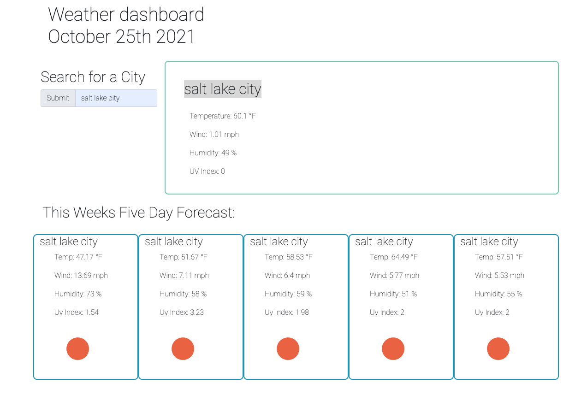

# awesome-weather-dashboard
* A weather dashboard that uses <link href="https://openweathermap.org/api".> The user is able to search by city to display weather for the day and the five day forcast for the city. Data included was wind speed, temperature, uv index and humidity. 

## Built with 
* HTML 
* JavaScript 
* CSS 

## Website 
file:///Users/bridgetschaefer/Desktop/weather-dashboard/awesome-weather-dashboard/index.html

